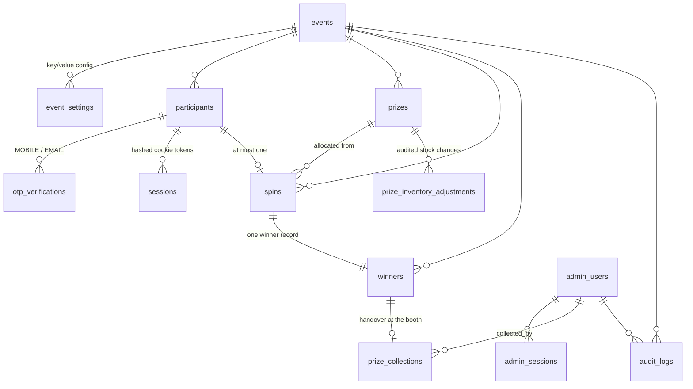

# Database

PostgreSQL (Supabase). Two migrations, applied in order:

- `supabase/migrations/0001_schema.sql` — enums, tables, indexes, triggers, row level security
- `supabase/migrations/0002_functions.sql` — `allocate_spin`, `collect_prize`, `adjust_inventory`, `event_stats`, helpers

Both are idempotent (`create ... if not exists`, `create or replace`), so re-running them
on an existing database is safe.

## ERD

## Tables

| Table | Holds |
|---|---|
| `events` | One row per event: code, name, venue, date, registration and spin windows, max participants, active flag |
| `event_settings` | Per-event JSON config: branding, privacy notice, consent text, form fields, OTP policy |
| `participants` | Registration details, normalised mobile and email, verification timestamps, status |
| `otp_verifications` | One row per code issued: channel, HMAC hash, expiry, attempts, consumed timestamp |
| `sessions` | Participant sessions. Stores a SHA-256 of the cookie token, never the token |
| `prizes` | Prize master: display name, description, initial and remaining quantity, weight, order, colour, active flag |
| `prize_inventory_adjustments` | Every manual stock change with previous value, delta, new value, reason, admin |
| `spins` | One row per spin. `unique (event_id, participant_id)` is the one-spin rule |
| `winners` | Prize, unique winner code, timestamp, collection status |
| `prize_collections` | Handover record: admin, timestamp, notes. Unique per winner |
| `admin_users` | Email, bcrypt hash, role, optional event scope, failed-login counters |
| `admin_sessions` | Hashed admin session tokens, separate from participant sessions |
| `audit_logs` | Action, actor, entity, hashed IP, JSON metadata |
| `rate_limit_events` | Fixed-window counters per bucket and key |

## Constraints that carry the business rules

| Constraint | Guarantees |
|---|---|
| `spins_one_per_participant unique (event_id, participant_id)` | One spin per attendee, enforced even if the API is bypassed |
| `winners_one_per_participant unique (event_id, participant_id)` | One prize per attendee |
| `winners.winner_code unique` | Codes never collide |
| `winners.spin_id unique` | A spin cannot produce two winners |
| `prize_collections.winner_id unique` | A prize cannot be collected twice |
| `prizes.remaining_quantity >= 0` | Inventory cannot go negative, whatever the caller does |
| `participants_verified_mobile_uq` (partial, verified rows only) | One verified mobile per event |
| `participants_verified_email_uq` (partial, verified rows only) | One verified email per event |
| `prizes unique (event_id, name)` | No duplicate prize codes within an event |

Partial unique indexes are used for mobile and email so an abandoned, unverified
registration never blocks the real owner of that number from registering later.

## Indexes

`participants` on event+mobile, event+email, company, name, created_at.
`winners` on winner_code, event, collection status, prize.
`spins` on event+created_at. `audit_logs` on event and action.
`otp_verifications` partial index on live, unconsumed codes.
`rate_limit_events` on bucket+key+created_at.

## Functions

| Function | Purpose |
|---|---|
| `allocate_spin(event, participant, ip_hash, idempotency_key)` | The whole spin, in one transaction. Advisory lock per participant, returns the existing result on replay, locks prize rows, weighted pick, guarded decrement, writes spin + winner + audit. Returns `already_spun` and a `NO_INVENTORY` status rather than throwing for normal outcomes |
| `collect_prize(winner, admin, notes)` | Marks a prize collected once. A second attempt reports the earlier collection instead of creating another record |
| `adjust_inventory(prize, delta, reason, admin)` | Changes stock, refuses to take remaining below zero, writes an adjustment row and an audit entry |
| `event_stats(event)` | Dashboard counters in a single query: registrations, verification funnel, spins, winners, collected, pending |
| `gen_winner_code(prefix, len)` | Crockford-style alphabet with no 0/O/1/I, from `gen_random_bytes`, retried on collision |
| `secure_random_int(n)` | Uniform random from `pgcrypto`, used by the weighted pick |

## Row level security

RLS is enabled on every table with no public policies. All application access uses the
service role key from the server, so nothing is reachable with the anon key even if it
leaks. Do not expose the anon key to the browser for these tables, and do not add
permissive policies without re-reading `docs/SECURITY.md`.

## Multi-event

Every participant, prize, spin, winner, setting and audit row carries `event_id`. A second
event is a new row in `events` plus its prizes; set `EVENT_CODE` to serve it. No data is
shared between events, including the one-spin and one-verified-mobile constraints.
